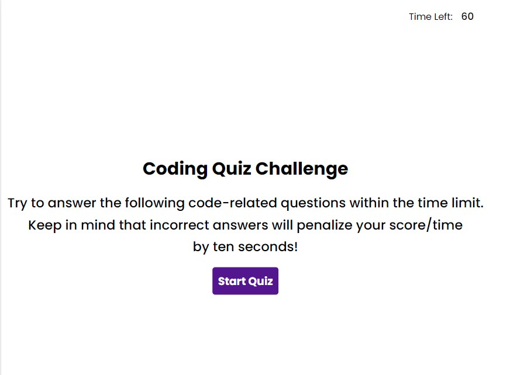

# Timed Quiz
  

  ## Description
  Timed quiz on coding questions in the browser

  ## Table of Contents
  * [Installation](#installation)
  * [Usage](#usage)
  * [License](#license)
  * [Contributing](#contributing)
  * [Tests](#tests)
  * [Questions](#questions)
  
  ## Project Image
  
  
  ## Installation 
  Download zip and open the index.html

  ## Usage 
  Run index.html in the browser

  ## License 
  This project is licensed under MIT license.

  ## License Link
  Information about the MIT license. https://choosealicense.com/licenses/mit/

  ## Contributing 
  Contact me to contribute

  ## Tests
  none

  ## Questions
  If you have any questions about this projects, please contact me directly at travis.helms@gmail.com. You can view more of my projects at https://github.com/SmasherCoder.

